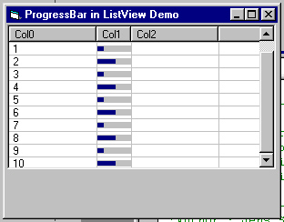



## Progressbar \(or other controls\) in ListView

### Description

This demo code shows how you can put progressbars into a listview control. Same principle works with other controls,too. For example commandbutton, picturebox or combobox. Works with horizontal, vertical and keyboard scrolling. Changing the column size is also no problem.

This demo uses subclassing. I used the subclassing control by SoftCircuits. You can get it for free at http://www.softcircuits.com.

Or use your own subclassing code. It should be no problem modifying the program to get it to work.
 
### More Info
 

             |
---                |---
**Submitted On**   |2001-08-30 16:55:18
**By**             |[Jens](https://github.com/Planet-Source-Code/PSCIndex/blob/master/ByAuthor/jens.md)
**Level**          |Intermediate
**User Rating**    |5.0 (60 globes from 12 users)
**Compatibility**  |VB 6\.0
**Category**       |[Custom Controls/ Forms/  Menus](https://github.com/Planet-Source-Code/PSCIndex/blob/master/ByCategory/custom-controls-forms-menus__1-4.md)
**World**          |[Visual Basic](https://github.com/Planet-Source-Code/PSCIndex/blob/master/ByWorld/visual-basic.md)
**Archive File**   |[Progressba256038302001\.zip](https://github.com/Planet-Source-Code/jens-progressbar-or-other-controls-in-listview__1-26653/archive/master.zip)

